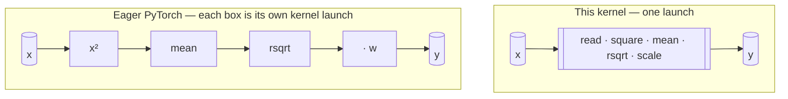

# fusedkernel — a fused Triton RMSNorm

This is a from-scratch [Triton](https://github.com/openai/triton) implementation
of **RMSNorm** — the normalization layer inside Llama, Qwen, Mistral, and Gemma —
with the forward *and* backward passes fused into single kernels and plugged into
PyTorch autograd. I wrote it to see how close a hand-rolled kernel could get to
the memory-bandwidth ceiling of an H100, and then actually ran it on one to find
out.

Short version: on an H100 it's about **6× faster** than the stock PyTorch
spelling and pushes roughly **45% of the card's peak HBM bandwidth**. More on what
that does and doesn't mean below.

```
forward · M=4096 · N=8192 · H100 80GB SXM (HBM3, 3.35 TB/s peak)

bf16   ██████████████████░░░░░░░░░░░░░░░░░░░░░░   44.9% peak · 5.96x
fp16   █████████████████░░░░░░░░░░░░░░░░░░░░░░░   41.3% peak · 5.48x
       └──────── filled = bandwidth used · empty = headroom ────────┘
```

---

## The problem: RMSNorm is all memory, no math

RMSNorm takes a row $x \in \mathbb{R}^{N}$, divides it by its root-mean-square,
and scales by a learned gain $w$:

$$
\operatorname{rms}(x) = \sqrt{\frac{1}{N}\sum_{j} x_j^{2} + \epsilon}
\qquad\qquad
y_i = \frac{x_i}{\operatorname{rms}(x)}\, w_i
$$

There's no mean-subtraction and no bias like in LayerNorm — it's just a rescale.
So per element you're doing a couple of multiplies and one `rsqrt`. That's
nothing. The expensive part is moving `x` and `y` across HBM, which means the
whole game is: **touch memory as few times as possible.**

Here's where stock PyTorch falls down. The obvious spelling

```python
variance = x.pow(2).mean(dim=-1, keepdim=True)
x = x * torch.rsqrt(variance + eps)
return weight * x
```

looks like one line of math but compiles to a *chain of separate CUDA kernels*,
and every link in that chain reads the activation back out of HBM and writes it
again. For a memory-bound op, those round-trips basically *are* the runtime:



In the **eager** path, every arrow between boxes is a trip out to HBM and back.
The **fused** path does one read and one write, full stop. Collapsing those trips
is the entire speedup — and you can predict it: kill ~6 round-trips, get ~6×.

## How the kernel works

Everything is in [`kernels/rmsnorm.py`](kernels/rmsnorm.py), one file. The pieces
that matter:

**One program per row.** Each Triton program grabs a single row and keeps the
whole thing in registers/SRAM, so the forward pass reads `x` once and writes `y`
once — there's never a second pass over the data. The tile width is just
`next_power_of_2(N)` so one tile covers a row, with the tail masked off when `N`
isn't a power of two. I cap `N` at 65536 so a pathologically wide row fails with a
clear error instead of silently overflowing the tile.

**Reductions always run in fp32.** Even when the tensor is fp16 or bf16, I upcast
on load and only round back down when storing `y`. Summing `N` squares is exactly
the spot where low precision hurts, and doing the sum in fp32 is what keeps the
kernel inside a tight tolerance against the reference. Cheap insurance.

**The backward reuses the forward's work.** Forward stashes `rstd = 1/rms` (one
float per row, nothing traffic-wise) and the backward reads it straight back, so
the reduction never gets recomputed.

**The weight gradient avoids atomics.** Writing $\hat{x}_i = x_i\,\operatorname{rstd}$
for the normalized activation and $\operatorname{dyw}_i = dy_i\, w_i$ for the
upstream grad folded with the gain, the two gradients are:

$$
dx_i = \operatorname{rstd}\left(\operatorname{dyw}_i - \hat{x}_i \cdot \frac{1}{N}\sum_{j} \operatorname{dyw}_j\,\hat{x}_j\right)
\qquad\qquad
dw_i = \sum_{\text{rows}} dy_i\,\hat{x}_i
$$

`dx` is per-row, so it parallelizes for free. `dw` is the annoying one — it sums a
contribution from *every* row into one shared `[N]` vector, which is the classic
"reach for atomics" situation. I didn't. Instead each program keeps its own
private `[N]` accumulator and walks a chunk of rows with a grid-stride loop, so no
two programs ever touch the same memory. At the end a small `torch.sum` folds the
`[n_programs, N]` partials down to `[N]`. Program count is capped at the SM count,
which keeps that partial buffer tiny.

**Autotuned per `N`.** A decorator sweeps `num_warps ∈ {1,2,4,8,16,32}` and
`num_stages ∈ {1,2,4}` and caches the winner per hidden size. Those are the two
knobs that actually matter for a streaming kernel — how many warps gang up on a
row, and how deep the load pipeline is. The tile size isn't autotuned because
correctness pins it.

The whole thing is wrapped in a `torch.autograd.Function`, so `rmsnorm(x, w)` is a
drop-in differentiable op — it flattens any `[..., N]` input down to `[M, N]`
(RMSNorm only ever touches the last dim) and reshapes back on the way out.

## Checking it's actually correct

Tests are in [`tests/test_rmsnorm.py`](tests/test_rmsnorm.py). One deliberate
choice here: I don't bit-match against an eager fp16 implementation, because two
*correct* fp16 kernels can disagree in the last bit just from rounding order.
Matching one spelling exactly would be testing the wrong thing.

Instead everything is compared against an **fp32 oracle** — the true value worked
out entirely in fp32 and only rounded to fp16/bf16 at the very end — with
tolerances set per dtype (tighter for fp16, looser for bf16, since bf16 has fewer
mantissa bits). The backward is checked the same way: analytic Triton gradients
against autograd's gradients of that oracle. The honest claim that buys you is
"within X of the true answer," not "identical to some other code I happened to
write."

It runs across `{2048, 4096, 8192}` hidden dims × `{512, 1024, 2048, 4096}` rows ×
`{fp16, bf16}`, plus non-power-of-two and 3D shapes, plus the gradient checks.

On the H100: **40 passed** (Slurm job `604545`, node `trig0006`, 1m57s, exit 0).

## How I benchmarked it

The sweep is [`bench/benchmark.py`](bench/benchmark.py). Since this is
memory-bound, reporting FLOP/s would be misleading — the number that means
something is **effective bandwidth as a fraction of what the card can do.**

- Timing goes through `triton.testing.do_bench`, which warms up, runs many reps,
  takes the median, and throws away the cold launches — so autotuning and
  first-compile don't leak into the measurement.
- Bytes moved counts only the activation traffic that the kernel *has* to do:
  forward is read `x` + write `y` (`2·M·N`), backward is read `x` + read `dy` +
  write `dx` (`3·M·N`). The `w`/`rstd`/partial-buffer traffic is `O(M+N)` and
  rounding error next to that, so I leave it out — that's the honest denominator.
- `% of peak` divides by whatever you pass in `RMSNORM_PEAK_GBPS` (3350 for the
  H100 SXM, 2039 for an A100). Nothing about the device is hard-coded.
- Same shapes as the test suite, so the perf numbers describe the exact kernels
  that just passed correctness.

It drops a CSV (`bench/results/rmsnorm_benchmark.csv`) and per-dtype latency /
%-of-peak plots.

## Results on an H100

Run on one NVIDIA H100 80GB SXM (HBM3, 3.35 TB/s). Slurm job `604586`, node
`trig0024`, 1m12s, exit 0.

Forward pass at the biggest shape in the sweep (M=4096, N=8192):

| dtype | fused      | eager      | speedup | GB/s   | % of peak |
|-------|-----------:|-----------:|--------:|-------:|----------:|
| bf16  | 0.0893 ms  | 0.5322 ms  | 5.96×   | 1503.4 | 44.9%     |
| fp16  | 0.0970 ms  | 0.5319 ms  | 5.48×   | 1384.1 | 41.3%     |

(The full grid — every `M × N × dtype` for both forward and backward — is in the
generated CSV; these are the headline rows.)

A few honest takeaways:

The **~6× is exactly what the diagram up top predicts.** Eager is six kernels each
re-reading the activation; the fused version reads once and writes once. The
measured speedup lining up with the round-trips you removed is the satisfying part
— it means the win is structural, not luck.

The **~45% of peak is the number I'd actually scrutinize.** Being bandwidth-bound
at all is good news: it means the kernel isn't stalling on launches or wasting time
on math, it's genuinely limited by the memory bus, which is the right place to be
for an op like this. But 45% isn't the ceiling — a really well-tuned streaming
kernel on H100 lands closer to 70–80%. So there's real headroom left, and I know
roughly where it lives (vectorization width, the one-program-per-row layout at
large `N`, the warp/stage choices). That's the next thing I'd chase.

bf16 also edges fp16 (1503 vs 1384 GB/s) at the same byte count — a
conversion-path quirk, not anything algorithmic.

So: correct, shippable, a clean 6× over eager, and about half the bandwidth budget
still on the table. I'd rather state that plainly than dress it up.

## Using it

```python
import torch
from kernels import rmsnorm

x = torch.randn(4096, 8192, device="cuda", dtype=torch.bfloat16)
w = torch.ones(8192, device="cuda", dtype=torch.bfloat16)

y = rmsnorm(x, w, eps=1e-6)   # differentiable — y.sum().backward() just works
```

`kernels.rmsnorm_reference` is the fp32 oracle the tests use (it matches Hugging
Face's `LlamaRMSNorm`), handy as a baseline.

## What's where

```
kernels/rmsnorm.py      the fused forward + backward kernel and autograd glue
tests/test_rmsnorm.py   correctness + gradient tests against the fp32 oracle
bench/benchmark.py      the latency / bandwidth sweep
bench/results/          generated CSV + plots
slurm/                  SLURM scripts for the Trillium H100 cluster
RUN.md                  running on a generic cloud GPU (Lambda / RunPod / …)
TRILLIUM.md             running on SciNet's Trillium H100 cluster
```

## Running it yourself

You need a single NVIDIA GPU (A100 80GB or H100), CUDA 12.x, and Python 3.10+.

```bash
python -m venv .venv && source .venv/bin/activate
pip install -r requirements.txt
pytest -q          # correctness gate — skips cleanly on a CPU-only box
```

The first `pytest` run is slow while Triton autotunes and compiles each shape;
after that it caches under `.triton/`. For the full cluster walkthroughs see
[`RUN.md`](RUN.md) (generic cloud GPU) or [`TRILLIUM.md`](TRILLIUM.md) (Trillium,
which deals with the no-internet compute nodes and read-only `$HOME`).

## License

See [`LICENSE`](LICENSE).
